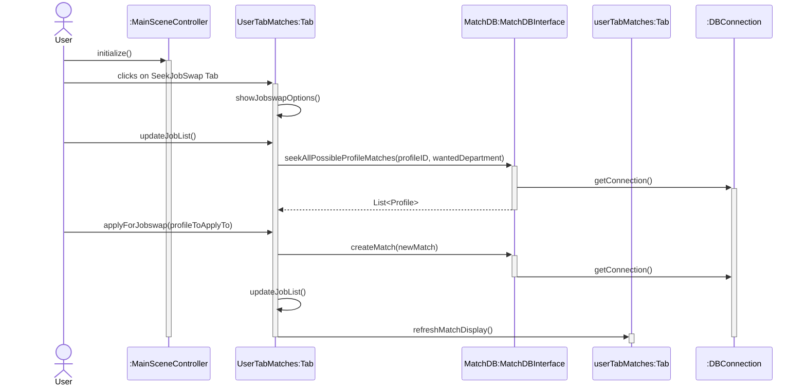
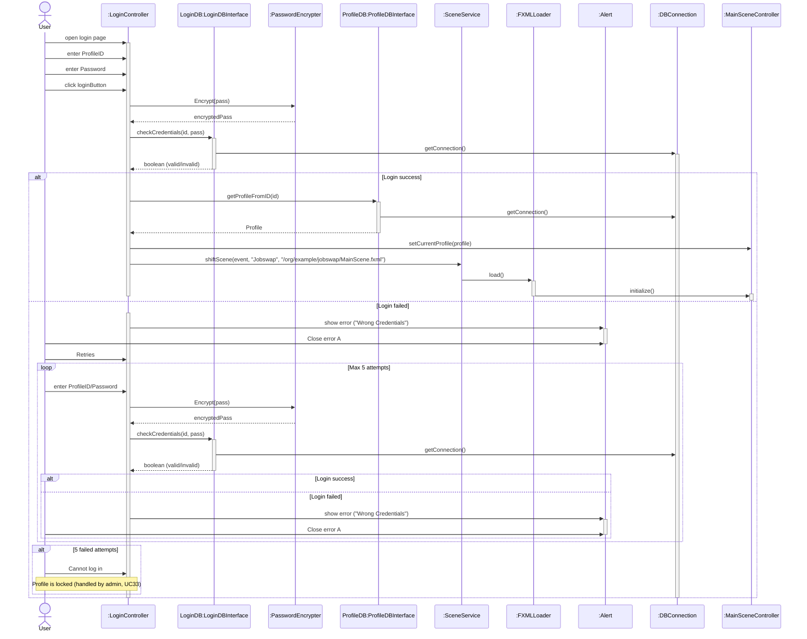
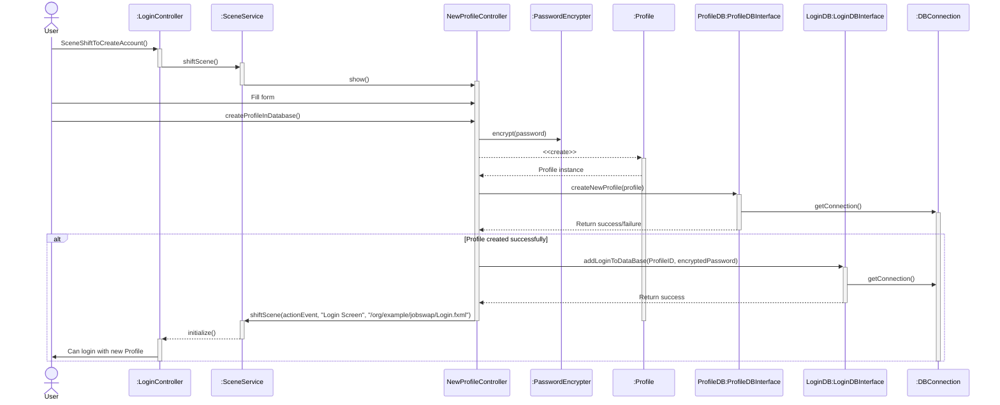

# Job-Swap
This is a 2nd Semester Computer Science project about a Job-Swap application.
This application allows employees to switch jobs permanently with other employees in order to work closer to where they live.

This project contains the first interation of the project with 2 more expected "in theory" for the program to be finished.

### Case
More than 1.2 million danes commutes to and from work every day.
This causes large socioeconomic and personal costs. 
A proposed solution to this is a Job-swap between two employees that have the same position and lives close to
each others workplaces.

##### Problem
* How can a possible Job-swap happen?
* How can a relationship between employees be made?
* How would such a solution be implemented?

## Solution
#### Tools
Database: Microsoft SQL
IDE: IntelliJ
Models Mermaid.live and Draw.io
Version Control: GitHub.com

Languages for the project.
* Java 
* T-SQL 
* SQL
* English

#### Glossary
Match       - A Match as different states but a match is when a user has 
requested another user.

| MatchState                    | Description                                                         |
|-------------------------------|---------------------------------------------------------------------|
| Requested                     | When another user has requested an owned users job                  |
| Application                   | When a owner user has requested another user                        |
| Interested                    | When both users are interested in switching (This enables Messages) |
| Match                         | When both users want to match/switch job                            |
| One profile is ready to match | A single profile wants to match                                     |
| Accepted Match                | HR has accepted the match                                           |

## Sequence Diagrams

#### Request Match

#### Login as User

#### Create User
