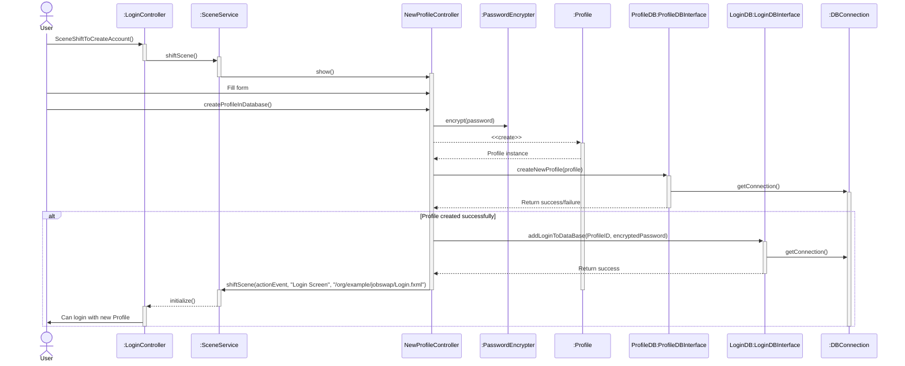
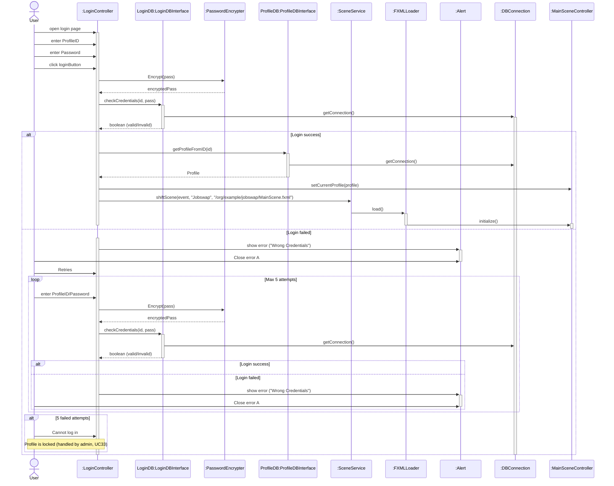
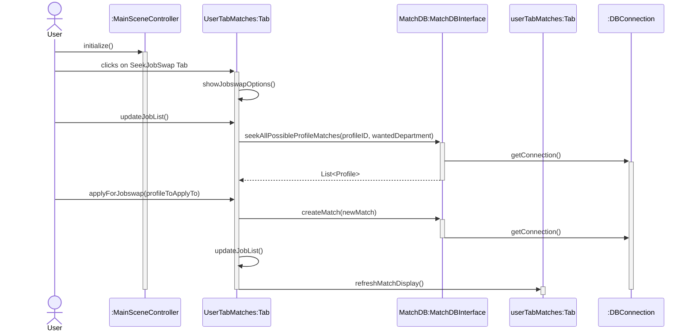

# Job-Swap
This is a 2nd Semester Computer Science project about a Job-Swap application.
This application allows employees to switch jobs permanently with other employees in order to work closer to where they live.

This project contains the first interation of the project with 2 more expected "in theory" for the program to be finished.

### Case
More than 1.2 million danes commutes to and from work every day.
This causes large socioeconomic and personal costs. 
A proposed solution to this is a Job-swap between two employees that have the same position and lives close to
each others workplaces.

##### Problem
* How can a possible Job-swap happen?
* How can a relationship between employees be made?
* How would such a solution be implemented?

## Solution
#### Tools
Database: Microsoft SQL
IDE: IntelliJ
Models Mermaid.live and Draw.io
Version Control: GitHub.com

Languages for the project.
* Java 
* T-SQL 
* SQL
* English

#### Glossary
Match       - A Match as different states but a match is when a user has 
requested another user.

| MatchState                    | Description                                                         |
|-------------------------------|---------------------------------------------------------------------|
| Requested                     | When another user has requested an owned users job                  |
| Application                   | When a owner user has requested another user                        |
| Interested                    | When both users are interested in switching (This enables Messages) |
| Match                         | When both users want to match/switch job                            |
| One profile is ready to match | A single profile wants to match                                     |
| Accepted Match                | HR has accepted the match                                           |


## Sequence Diagrams

#### Create User


#### Login as User


#### Request Match



## Database
#### Setup

```sql
-- Create the Database
CREATE DATABASE [Danfoss Jobswap DB];
GO

USE [Danfoss Jobswap DB];
GO

-- Table: State
CREATE TABLE tbl_MatchState (
    MatchStateID INT IDENTITY(1,1) PRIMARY KEY,
    MatchState NVARCHAR(100) NOT NULL
);

-- Table: JobCategory
CREATE TABLE tbl_JobCategory (
    JobCategoryID INT IDENTITY(1,1) PRIMARY KEY,
    JobCategory NVARCHAR(100) NOT NULL
);

-- Create tbl_Department without HRDepartmentID foreign key
CREATE TABLE tbl_Department (
    DepartmentID INT IDENTITY(1,1) PRIMARY KEY,
    City NVARCHAR(100) NOT NULL,
    DepartmentName NVARCHAR(100) NOT NULL
);

-- Table: Profile (without DepartmentID foreign key)
CREATE TABLE tbl_Profile (
    ProfileID INT PRIMARY KEY,
    DepartmentID INT NOT NULL,
    JobCategoryID INT NOT NULL,
    AccessLevelID INT NOT NULL,
    FullName NVARCHAR(100) NOT NULL,
    Username NVARCHAR(100) NOT NULL,
    JobTitle NVARCHAR(100) NOT NULL,
    ActivelySeeking BIT NOT NULL,
    JobDescription VARCHAR(100) NOT NULL,
    IsLocked BIT NOT NULL,
    FOREIGN KEY (JobCategoryID) REFERENCES tbl_JobCategory(JobCategoryID)
);

-- Foreign key constraint for DepartmentID in Profile
ALTER TABLE tbl_Profile
    ADD CONSTRAINT FK_Profile_Department
    FOREIGN KEY (DepartmentID) REFERENCES tbl_Department(DepartmentID);

-- Table: Login
CREATE TABLE tbl_Login (
    LoginID INT IDENTITY(1,1) PRIMARY KEY,
    ProfileID INT NOT NULL,
    LoginPassword NVARCHAR(100) NOT NULL,
    FOREIGN KEY (ProfileID) REFERENCES tbl_Profile(ProfileID)
);

-- Table: Match
CREATE TABLE tbl_Match (
    MatchID INT IDENTITY(1,1) PRIMARY KEY,
    Profile1ID INT NOT NULL,
    Profile2ID INT NOT NULL,
    MatchStateID INT NOT NULL,
    TimeOfMatch DATETIME2 DEFAULT GETDATE(),
    FirstToAcceptProfileID INT,
    FOREIGN KEY (Profile1ID) REFERENCES tbl_Profile(ProfileID),
    FOREIGN KEY (Profile2ID) REFERENCES tbl_Profile(ProfileID),
    FOREIGN KEY (MatchStateID) REFERENCES tbl_MatchState(MatchStateID),

    --Checks if profiles have the same ID
    CONSTRAINT chk_Profile1_Profile2 CHECK (Profile1ID <> Profile2ID)
);

-- Table: Message
CREATE TABLE tbl_Message (
    MessageID INT IDENTITY(1,1) PRIMARY KEY,
    MatchID INT NOT NULL,
    ProfileIDOfSender INT NOT NULL,
    ProfileIDOfReceiver INT NOT NULL,
    MessageText NVARCHAR(300),
    TimeOfMessage DATETIME2 DEFAULT GETDATE(),
    FOREIGN KEY (MatchID) REFERENCES tbl_Match(MatchID),
    FOREIGN KEY (ProfileIDOfSender) REFERENCES tbl_Profile(ProfileID)
);

-- Table: Report
CREATE TABLE tbl_Report (
    ReportID INT IDENTITY(1,1) PRIMARY KEY,
    MessageID INT NOT NULL,
    TimeOfReport DATETIME2 DEFAULT GETDATE(),
    FOREIGN KEY (MessageID) REFERENCES tbl_Message(MessageID)
);


--DATA VALUES
-- Insert match states
INSERT INTO tbl_MatchState (MatchState)
VALUES
    ('Requested'),
    ('Application'),
    ('Both interested'),
    ('Match'),
    ('OneProfileIsReadyToMatch'),
    ('TwoProfileIsReadyToMatch'),
    ('Accepted');


-- Insert job categories
INSERT INTO tbl_JobCategory (JobCategory)
VALUES
    ('Engineering'),
    ('Human Resources'),
    ('Finance'),
    ('IT'),
    ('Marketing'),
    ('Operations'),
    ('Sales'),
    ('Research & Development'),
    ('Quality Assurance'),
    ('Production'),
    ('Sanitation'),
    ('Customer Service');

--Insert departments
INSERT INTO tbl_Department (City, DepartmentName)
VALUES
    ('Nordborg', 'Danfoss Power Solutions'),
    ('Gråsten', 'Danfoss Power Electronics'),
    ('Kolding', 'Danfoss Heat Exchanger Production'),
    ('Sunds', 'Gemina Termix Production'),
    ('Silkeborg', 'Danfoss Redan'),
    ('København', 'Danfoss Sales'),
    ('Vejle', 'Danfoss IXA'),
    ('Rødekro', 'Danfoss Distribution Services');


CREATE OR ALTER PROCEDURE seek_all_possible_profile_matches(@ProfileID int, @WantedDepartment NVARCHAR(100))

AS

BEGIN

    DECLARE
        @JobCategory NVARCHAR(100),
        @JobCategoryID int,
        @WantedDepartmentID int;

    --Converts the wanted departmentname to depID
    SELECT @WantedDepartmentID = DepartmentID
    FROM tbl_Department
    WHERE DepartmentName = @WantedDepartment

    -- converts jobcategory to jobcategoryID
    SELECT @JobCategoryID = JobCategoryID
    FROM tbl_JobCategory
    WHERE JobCategory = @JobCategory

    -- gets jobcategory from profileID
    SELECT @JobCategoryID = JobCategoryID
    FROM tbl_Profile
    WHERE ProfileID = @ProfileID

    -- Selects all profiles where the wantedjobdepartment and the currently working
    -- Jobcategory and actively seeking mathces the criteria
    SELECT * FROM tbl_Profile where DepartmentID=@WantedDepartmentID
                                AND JobCategoryID=@JobCategoryID
                                AND ActivelySeeking= 1;


END;


    CREATE OR ALTER PROCEDURE seek_all_possible_profile_matches(@ProfileID int, @WantedDepartment NVARCHAR(100))

    AS

    BEGIN

        DECLARE
            @JobCategory NVARCHAR(100),
            @JobCategoryID int,
            @WantedDepartmentID int;

        --Converts the wanted departmentname to depID
        SELECT @WantedDepartmentID = DepartmentID
        FROM tbl_Department
        WHERE DepartmentName = @WantedDepartment

        -- converts jobcategory to jobcategoryID
        SELECT @JobCategoryID = JobCategoryID
        FROM tbl_JobCategory
        WHERE JobCategory = @JobCategory

        -- gets jobcategory from profileID
        SELECT @JobCategoryID = JobCategoryID
        FROM tbl_Profile
        WHERE ProfileID = @ProfileID

        -- Selects all profiles where the wantedjobdepartment and the currently working
        -- Jobcategory and actively seeking mathces the criteria.
        --Returns the profile with departmentname and jobcategory instead of IDs
        SELECT
            p.ProfileID,
            d.DepartmentName,
            j.JobCategory,
            p.AccesslevelID,
            p.FullName,
            p.Username,
            p.JobTitle,
            p.ActivelySeeking,
            p.JobDescription,
            p.IsLocked
        FROM tbl_Profile p
                 INNER JOIN
             tbl_Department d ON p.DepartmentID = d.DepartmentID
                 INNER JOIN
             tbl_JobCategory j ON p.JobCategoryID = j.JobCategoryID

        where p.DepartmentID=@WantedDepartmentID
          AND p.JobCategoryID=@JobCategoryID
          AND ActivelySeeking= 1;

    END;


    CREATE OR ALTER PROCEDURE create_match
        @Profile1ID int,
        @Profile2ID int,
        @MatchStateID int,
        @TimeOfMatch DATETIME2(7)

    AS

    BEGIN

        DECLARE @ExistingMatchID int

        -- Checks if match exists with profile 1 and 2 ID in case that one profile spams the other profile
-- with request
        IF EXISTS (
            SELECT 1 FROM tbl_Match
            WHERE (Profile1ID = @Profile1ID AND Profile2ID = @Profile2ID)
        )
            BEGIN
                -- Return a message if match exists
                SELECT 'Match already exists between these profiles' AS Result;
                RETURN;
            END;

        -- if profile one has an application from profile 2 but havent seen it
--and sends application the application the state of the match will be interested
        SELECT @ExistingMatchID = MatchID
        FROM tbl_Match
        WHERE Profile1ID = @Profile2ID AND Profile2ID = @Profile1ID;

        IF @ExistingMatchID > 0
            BEGIN
                UPDATE dbo.tbl_Match SET MatchStateID=3 WHERE MatchID = @ExistingMatchID
                RETURN;
            END;


        INSERT INTO tbl_Match (Profile1ID,Profile2ID,MatchStateID
                                ,TimeOfMatch)
        VALUES
            (@Profile1ID, @Profile2ID, @MatchStateID,@TimeOfMatch)


    END;


    CREATE OR ALTER PROCEDURE update_matchstate_of_both_interested_to_complete_match
        @Profile1ID int,
        @Profile2ID int,
        @loggedInProfileID int

    AS
    BEGIN

        --DECLARES
        DECLARE
            @MatchID int,
            @CurrentMatchStateID Int,
            @OtherProfileID int,
            @FirstToAcceptProfileID int

        --get matchID based on both profiles, the state of the match, and FirstToAcceptProfileID.
        SELECT @MatchID = MatchID, @CurrentMatchStateID = MatchStateID ,@FirstToAcceptProfileID = FirstToAcceptProfileID
        FROM tbl_Match
        WHERE (Profile1ID = @Profile2ID AND Profile2ID = @Profile1ID)
            or (Profile1ID = @Profile1ID AND Profile2ID = @Profile2ID)

        --set matchstate to 4 and record who did it.
        IF @CurrentMatchStateID = 3 --both are interested
            BEGIN
                UPDATE dbo.tbl_Match SET MatchStateID=4, FirstToAcceptProfileID = @loggedInProfileID WHERE MatchID = @MatchID
            END
        ELSE IF (@CurrentMatchStateID = 4 AND @FirstToAcceptProfileID <> @loggedInProfileID)
            BEGIN
                UPDATE dbo.tbl_Match
                SET MatchStateID = 5
                WHERE MatchID = @MatchID
            END

    END;


    CREATE PROCEDURE create_new_profile
        @DepartmentName NVARCHAR(100),
        @JobCategory NVARCHAR(100),
        @AccessLevelID int,
        @FullName Nvarchar (100),
        @Username Nvarchar (100),
        @JobTitle Nvarchar (100),
        @ActivelySeeking Bit,
        @JobDescription Nvarchar (300),
        @IsLocked Bit

    AS
    BEGIN

        DECLARE @DepartmentID INT
        DECLARE @JobCategoryID INT

        SELECT @DepartmentID = DepartmentID
        FROM tbl_Department
        WHERE DepartmentName = @DepartmentName

        SELECT @JobCategoryID = JobCategoryID
        FROM tbl_JobCategory
        WHERE JobCategory = @JobCategory

        INSERT INTO tbl_Profile (DepartmentID,JobCategoryID,AccessLevelID,
                                    FullName, Username, JobTitle, ActivelySeeking, JobDescription, IsLocked)

        VALUES

            (@DepartmentID, @JobCategoryID, @AccessLevelID, @FullName, @Username,
                @JobTitle,@ActivelySeeking,@JobDescription,@IsLocked)

    END;


    CREATE OR ALTER PROCEDURE getProfileFromID
        @ProfileID INT
    AS
    BEGIN
        -- Check if profile exists
        IF NOT EXISTS (SELECT 1 FROM tbl_Profile WHERE ProfileID = @ProfileID)
            BEGIN
                -- Return a message that the profile doesn't exist
                SELECT 'Profile with ID ' + CAST(@ProfileID AS VARCHAR(10)) + ' does not exist' AS Message;
                RETURN;
            END

        -- Profile exists, return the data
        SELECT
            p.ProfileID,
            d.DepartmentName,
            j.JobCategory,
            p.AccesslevelID,
            p.FullName,
            p.Username,
            p.JobTitle,
            p.ActivelySeeking,
            p.JobDescription,
            p.IsLocked
        FROM tbl_Profile p
                    INNER JOIN tbl_Department d ON p.DepartmentID = d.DepartmentID
                    INNER JOIN tbl_JobCategory j ON p.JobCategoryID = j.JobCategoryID
        WHERE p.ProfileID = @ProfileID;
    END;


    CREATE OR ALTER PROCEDURE [dbo].[create_new_profile]
        @ProfileID int,
        @DepartmentName NVARCHAR(100),
        @JobCategory NVARCHAR(100),
        @AccessLevelID int,
        @FullName Nvarchar (100),
        @Username Nvarchar (100),
        @JobTitle Nvarchar (100),
        @ActivelySeeking Bit,
        @JobDescription Nvarchar (300),
        @IsLocked Bit
    AS
    BEGIN

        DECLARE @DepartmentID INT
        DECLARE @JobCategoryID INT
        --Converts Text to ID (could have used join)
        SELECT @DepartmentID = DepartmentID
        FROM tbl_Department
        WHERE DepartmentName = @DepartmentName
        --Converts Text to ID (could have used join)
        SELECT @JobCategoryID = JobCategoryID
        FROM tbl_JobCategory
        WHERE JobCategory = @JobCategory

        -- Check if profile exists
        IF EXISTS (SELECT 1 FROM tbl_Profile WHERE ProfileID = @ProfileID)
            BEGIN
                -- Return a message that the profile does exist
                SELECT 'Profile with ID ' + CAST(@ProfileID AS VARCHAR(10)) + ' does exist' AS Message;
                RETURN;
            END

        --Creation of new profil
        INSERT INTO tbl_Profile (ProfileID,DepartmentID,JobCategoryID,AccessLevelID,
                                    FullName, Username, JobTitle, ActivelySeeking, JobDescription, IsLocked)
        VALUES
            (@ProfileID,@DepartmentID, @JobCategoryID, @AccessLevelID, @FullName, @Username,
                @JobTitle,@ActivelySeeking,@JobDescription,@IsLocked)
    END;


    ALTER PROCEDURE [dbo].[seek_all_possible_profile_matches](@ProfileID int, @WantedDepartment NVARCHAR(100))

    AS

    BEGIN

        DECLARE
            @JobCategoryID int,
            @WantedDepartmentID int;


-- First get the JobCategoryID from the source profile
    SELECT @JobCategoryID = JobCategoryID
    FROM tbl_Profile
    WHERE ProfileID = @ProfileID;

    --Converts the wanted departmentname to depID
    SELECT @WantedDepartmentID = DepartmentID
    FROM tbl_Department
    WHERE DepartmentName = @WantedDepartment

    -- Selects all profiles where the wantedjobdepartment and the currently working
    -- Jobcategory and actively seeking mathces the criteria.
    --Returns the profile with departmentname and jobcategory instead of IDs
    SELECT
        p.ProfileID,
        d.DepartmentName,
        j.JobCategory,
        p.AccesslevelID,
        p.FullName,
        p.Username,
        p.JobTitle,
        p.ActivelySeeking,
        p.JobDescription,
        p.IsLocked
    FROM tbl_Profile p
                INNER JOIN
            tbl_Department d ON p.DepartmentID = d.DepartmentID
                INNER JOIN
            tbl_JobCategory j ON p.JobCategoryID = j.JobCategoryID

    where p.DepartmentID=@WantedDepartmentID
        AND p.JobCategoryID=@JobCategoryID
        AND ActivelySeeking= 1;

    END;


    CREATE OR ALTER PROCEDURE [dbo].[update_profile]
        @ProfileID int,
        @DepartmentName NVARCHAR(100),
        @JobCategory NVARCHAR(100),
        @AccessLevelID int,
        @FullName Nvarchar (100),
        @Username Nvarchar (100),
        @JobTitle Nvarchar (100),
        @ActivelySeeking Bit,
        @JobDescription Nvarchar (300),
        @IsLocked Bit
    AS
    BEGIN

        DECLARE @DepartmentID INT
        DECLARE @JobCategoryID INT
        --Converts Text to ID (could have used join)
        SELECT @DepartmentID = DepartmentID
        FROM tbl_Department
        WHERE DepartmentName = @DepartmentName
        --Converts Text to ID (could have used join)
        SELECT @JobCategoryID = JobCategoryID
        FROM tbl_JobCategory
        WHERE JobCategory = @JobCategory

        --Update of profil
        UPDATE tbl_Profile
        SET
            DepartmentID = @DepartmentID,
            JobCategoryID = @JobCategoryID,
            AccessLevelID = @AccessLevelID,
            FullName = @FullName,
            Username = @Username,
            JobTitle = @JobTitle,
            ActivelySeeking = @ActivelySeeking,
            JobDescription = @JobDescription,
            IsLocked = @IsLocked
        WHERE
            ProfileID = @ProfileID
    END;


    CREATE OR ALTER PROCEDURE [dbo].[getProfileFromID]
        @ProfileID INT
    AS
    BEGIN
        -- Check if profile exists
        IF NOT EXISTS (SELECT 1 FROM tbl_Profile WHERE ProfileID = @ProfileID)
            BEGIN
                -- Return a message that the profile doesn't exist
                SELECT 'Profile with ID ' + CAST(@ProfileID AS VARCHAR(10)) + ' does not exist' AS Message;
                RETURN;
            END

        -- Profile exists, return the data
        SELECT
            p.ProfileID,
            d.DepartmentName,
            j.JobCategory,
            p.AccesslevelID,
            p.FullName,
            p.Username,
            p.JobTitle,
            p.ActivelySeeking,
            p.JobDescription,
            p.IsLocked
        FROM tbl_Profile p
                    INNER JOIN tbl_Department d ON p.DepartmentID = d.DepartmentID
                    INNER JOIN tbl_JobCategory j ON p.JobCategoryID = j.JobCategoryID
        WHERE p.ProfileID = @ProfileID;
    END;


    SET ANSI_NULLS ON
GO
SET QUOTED_IDENTIFIER ON
GO

ALTER PROCEDURE [dbo].[update_matchstate_of_both_interested_to_complete_match]
    @Profile1ID int,
    @Profile2ID int,
    @loggedInProfileID int

AS
BEGIN

    --DECLARES
    DECLARE
        @MatchID int,
        @CurrentMatchStateID Int,
        @OtherProfileID int,
        @FirstToAcceptProfileID int

    --get matchID based on both profiles, the state of the match, and FirstToAcceptProfileID.
    SELECT @MatchID = MatchID, @CurrentMatchStateID = MatchStateID ,@FirstToAcceptProfileID = FirstToAcceptProfileID
    FROM tbl_Match
    WHERE (Profile1ID = @Profile2ID AND Profile2ID = @Profile1ID)
       or (Profile1ID = @Profile1ID AND Profile2ID = @Profile2ID)

    --set matchstate to 5 and record who did it.
    IF @CurrentMatchStateID = 3 --both are interested
        BEGIN
            UPDATE dbo.tbl_Match SET MatchStateID=5, FirstToAcceptProfileID = @loggedInProfileID WHERE MatchID = @MatchID
        END
    ELSE IF (@CurrentMatchStateID = 5 AND @FirstToAcceptProfileID <> @loggedInProfileID)
        BEGIN
            UPDATE dbo.tbl_Match
            SET MatchStateID = 4
            WHERE MatchID = @MatchID
        END

END;


ALTER PROCEDURE [dbo].[seek_all_possible_profile_matches](@ProfileID int, @WantedDepartment NVARCHAR(100))

AS

BEGIN

    DECLARE
        @JobCategoryID int,
        @WantedDepartmentID int;


-- First get the JobCategoryID from the source profile
    SELECT @JobCategoryID = JobCategoryID
    FROM tbl_Profile
    WHERE ProfileID = @ProfileID;

    --Converts the wanted departmentname to depID
    SELECT @WantedDepartmentID = DepartmentID
    FROM tbl_Department
    WHERE DepartmentName = @WantedDepartment

    -- Selects all profiles where the wantedjobdepartment and the currently working
    -- Jobcategory and actively seeking mathces the criteria.
    --Returns the profile with departmentname and jobcategory instead of IDs
    -- Only returns if the profiles does not have a match already
    SELECT
        p.ProfileID,
        d.DepartmentName,
        j.JobCategory,
        p.AccesslevelID,
        p.FullName,
        p.Username,
        p.JobTitle,
        p.ActivelySeeking,
        p.JobDescription,
        p.IsLocked
    FROM tbl_Profile p
                INNER JOIN
            tbl_Department d ON p.DepartmentID = d.DepartmentID
                INNER JOIN
            tbl_JobCategory j ON p.JobCategoryID = j.JobCategoryID
    WHERE
        p.DepartmentID = @WantedDepartmentID
        AND p.JobCategoryID = @JobCategoryID
        AND p.ActivelySeeking = 1
        AND NOT EXISTS (
        SELECT 1
        FROM tbl_Match
        WHERE Profile1ID = p.ProfileID OR Profile2ID = p.ProfileID
    );

END;

CREATE OR ALTER PROCEDURE get_all_messages_between_2_profiles_sort_by_time
    @LoggedInProfileID int,
    @ProfileIDReceiver int

AS
BEGIN


    SELECT
        ProfileIDOfSender,
        ProfileIDOfReceiver,
        MessageText,
        TimeOfMessage
    FROM
        tbl_Message
    WHERE
        (ProfileIDOfSender = @LoggedInProfileID AND ProfileIDOfReceiver = @ProfileIDReceiver)
        OR
        (ProfileIDOfSender = @ProfileIDReceiver AND ProfileIDOfReceiver = @LoggedInProfileID)
    ORDER BY
        TimeOfMessage ASC; -- ASC = Ascending Order

END;
```
